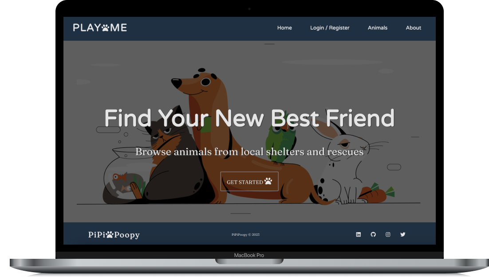

[![LinkedIn][linkedin]][Linkedin] [![Email][email]][Email] 

 

  

<h3 align="center">PLAYwME</h3>

  

          A platform to bridge the gap between animal lovers who want
          to contribute to bettering the well-being of shelter animals. PLAYwME
          was designed with empathy and purpose, connecting users with their
          local animal shelters. With your participation in using PLAYwME, you
          can make a meaningful difference in the lives of these animals and
          increase their chances of finding loving homes.
     
     
     
    <a href="#screenshot">View Demo</a>
  

<!-- TABLE OF CONTENTS -->

  
Table of Contents

  <ol>
    <li>
      <a href="#about-the-project">About The Project</a>
      <ul>
        <li><a href="#built-with">Built With</a></li>
      </ul>
    </li>
    <li>
      <a href="#getting-started">Getting Started</a>
      <ul>
        <li><a href="#prerequisites">Prerequisites</a></li>
        <li><a href="#installation">Installation</a></li>
      </ul>
    </li>
    <li><a href="#contact">Contact</a></li>
    <li><a href="#acknowledgments">Acknowledgments</a></li>
  </ol>

## About The Project

### Built With

[![JavaScript][javascript.js]][Javascript]
[![Node.js][node.js]][Node]
[![Express.js][express.js]][Express]
[![PostgreSQL][postgresql]][PostgreSQL]
[![React][react.js]][React]
[![Redux][redux]][Redux]
[![Redux-Saga][redux-saga]][Redux-Saga]
[![Material-UI][mui]][MUI]
[![Petfinder API][api]][API]

## Getting Started

### Prerequisites

Before you get started, make sure you have the following software installed on your computer:

- [Node.js](https://nodejs.org/en/)
- [PostrgeSQL](https://www.postgresql.org/)
- [Nodemon](https://nodemon.io/)

## Installation

1. Clone the repository to your local computer
1. Start postgres if not running already by using `brew services start postgresql`
1. Create a database named `playwme`
1. Run `database.sql` file
1. Open two terminal windows
1. Run `npm run server`
1. Run `npm run client`
1. Navigate to `localhost:3000`

### Screenshot

## Contact

**Quynh Dao** - dj@weheartmusic.com

[PLAYwME](https://github.com/quynhngandao/PLAYwME-solo-project)

<!-- ACKNOWLEDGMENTS -->

## Acknowledgments

Thanks to [Prime Digital Academy](www.primeacademy.io) who equipped and helped me to make this application a reality. Thank you to my instructor Emma Stout for being an awesome instructor!

(<a href="#top">back to top</a>)

<!-- MARKDOWN LINKS & IMAGES -->
<!-- https://www.markdownguide.org/basic-syntax/#reference-style-links -->

[linkedin]: https://img.shields.io/badge/-LinkedIn-black.svg?style=for-the-badge&logo=linkedin&colorB=555
[Linkedin]: https://www.linkedin.com/in/daoquynh29/
[react.js]: https://img.shields.io/badge/React-20232A?style=for-the-badge&logo=react&logoColor=61DAFB
[React]: https://reactjs.org/
[javascript.js]: https://img.shields.io/badge/JavaScript-20232A?style=for-the-badge&logo=JavaScript&logoColor=F7DF1E
[Javascript]: https://www.javascript.com/
[node.js]: https://img.shields.io/badge/Node.js-20232A?style=for-the-badge&logo=Node.js&logoColor=339933
[Node]: https://nodejs.org/en/
[express.js]: https://img.shields.io/badge/Express.js-20232A?style=for-the-badge&logo=Express&logoColor=F7DF1E
[Express]: https://expressjs.com/
[postgresql]: https://img.shields.io/badge/PostgreSQL-20232A?style=for-the-badge&logo=PostgreSQL&logoColor=4169E1
[PostgreSQL]: https://www.postgresql.org/
[redux]: https://img.shields.io/badge/Redux-20232A?style=for-the-badge&logo=Redux&logoColor=764ABC
[Redux]: https://redux.js.org/
[redux-saga]: https://img.shields.io/badge/Redux_Saga-20232A?style=for-the-badge&logo=Redux-Saga&logoColor=999999
[Redux-Saga]: https://redux-saga.js.org/
[mui]: https://img.shields.io/badge/Material_UI-20232A?style=for-the-badge&logo=MUI&logoColor=007FFF
[MUI]: https://mui.com/
[Screenshot]: https://github.com/quynhngandao/PLAYwME-solo-project/blob/main/public/images/Screenshot.gif
[email]: https://img.shields.io/badge/Gmail-D14836?style=for-the-badge&logo=gmail&logoColor=white
[Email]: dj@weheartmusic.com
[api]: https://img.shields.io/badge/petfinder-api?logo=petfinderapi&logoColor=purple&color=purple
[API]: https://restfulapi.net/
